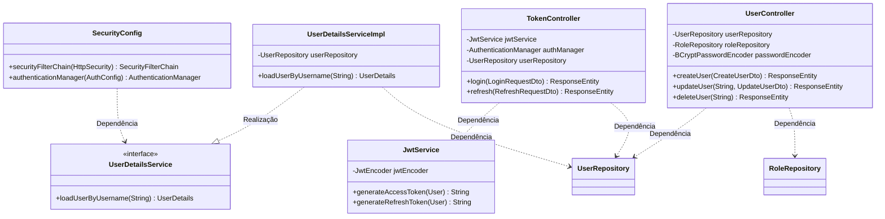

# Sistema de Autenticação e Autorização de Usuários
Sistema de Autenticação e Autorização de usuários, desenvolvido com Spring Security 6, integrando autenticação baseada em JWT (JSON Web Tokens) e OAUTH 2.0 (Resource Server).

## Novas Funcionalidades e Melhorias
Recentemente o projeto passou por uma refatoração para adotar padrões de mercado e aumentar a segurança:
- **Gestão de Sessão via Refresh Tokens**: Renovação automática de acesso sem novo login.
- **Segurança Refatorada**: Uso de `AuthenticationManager` e `UserDetailsService`.
- **Proteção contra BOLA**: Restrição de acesso a dados de outros usuários (Broken Object Level Authorization).
- **Validação de Dados**: Uso de Bean Validation para garantir integridade dos inputs.

## Tecnologias
- **Java 21**
- **Spring Boot 3.4**
- **Spring Security**
- **OAuth 2.0 (Resource Server)**
- **PostgreSQL**
- **Flyway** (Migration)
- **Swagger (OpenAPI 3)**
- **Docker & Docker Compose**

## Arquitetura do Sistema



## Configurando a Chave Pública e Chave Privada
Para configurar as chaves para autenticação via JWT, siga as instruções abaixo.

#### 1. Crie um diretório `jwt` dentro da pasta `resources`

#### 2. Acesse o diretório `jwt` e gere as chaves:
```bash
openssl genpkey -algorithm RSA -out app.key -outform PEM
openssl rsa -pubout -in app.key -out app.pub
```

## Configurando o Docker
Para criar a imagem e rodar o projeto:

1. **Gere o JAR**: `mvn clean package -DskipTests`
2. **Build da Imagem**: `docker build -t authenticator .`
3. **Subir Containers**: `docker-compose up -d`

## Documentação (Swagger)
Acesse a documentação interativa em:
[http://localhost:8080/swagger-ui/index.html](http://localhost:8080/swagger-ui/index.html)

---
**_Desenvolvido por Lucas Storck_**

